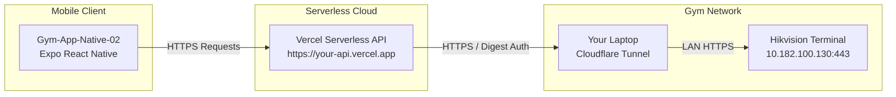

# Complete Deployment Guide: Hikvision Public IP + Vercel + React Native

This step-by-step guide explains how to deploy the **Hikvision Backend API** to **Vercel** and connect it to your physical **Hikvision Terminal** (Model: `DS-K1T320MFWX`) using a **Public IP with Port Forwarding**, and finally connect your **React Native Mobile App** (`Gym-App-Native-02`).

---

## 🏗️ System Architecture



---

## 📋 Table of Contents
1. [Phase 1: Hikvision Terminal & Router Port Forwarding](#phase-1-hikvision-terminal--router-port-forwarding)
2. [Phase 2: Deploying the Backend to Vercel](#phase-2-deploying-the-backend-to-vercel)
3. [Phase 3: Connecting the React Native Mobile App](#phase-3-connecting-the-react-native-mobile-app)
4. [Phase 4: Verification & Testing](#phase-4-verification--testing)
5. [Troubleshooting & Common Issues](#troubleshooting--common-issues)

---

## Phase 1: Hikvision Terminal & Router Port Forwarding

The goal is to allow Vercel’s cloud servers to reach your physical Hikvision terminal securely over the internet.

### Step 1.1: Lock Terminal Local IP (DHCP Reservation)
Your terminal must never change its LAN IP address when the router reboots.
1. Open your router's admin dashboard in a browser (e.g. `http://192.168.18.1` or `http://192.168.1.1`).
2. Navigate to **DHCP Server** ➔ **Address Reservation** (or **Static Lease**).
3. Find your Hikvision terminal (MAC address is printed on the back of the device or found in SADP tool).
4. Assign it a permanent static IP address: e.g. `192.168.18.229`.

### Step 1.2: Find Your Public IP (or Setup DDNS)
1. Check your router’s WAN IP at [ipify.org](https://api.ipify.org) or [whatismyip.com](https://www.whatismyip.com).
2. **If your ISP gives you a Dynamic IP that changes upon restart:**
   - Use a free Dynamic DNS service such as [DuckDNS](https://www.duckdns.org), [No-IP](https://www.noip.com), or your router’s built-in DDNS.
   - Example DDNS address: `mygymterminal.duckdns.org`

### Step 1.3: Add Port Forwarding Rule in Router
1. In your router settings, go to **Advanced** ➔ **Port Forwarding** / **Virtual Servers**.
2. Add a new forwarding rule:
   - **Service / Rule Name**: `Hikvision_API`
   - **External / WAN Port**: `8443` *(Recommended instead of 443 to avoid ISP blocking and internet scanners)*
   - **Internal / LAN IP Address**: `192.168.18.229` (your terminal IP)
   - **Internal / LAN Port**: `443` (terminal HTTPS port)
   - **Protocol**: `TCP`
3. Save and apply the settings.

### Step 1.4: Test Port Forwarding Locally
In the `hikvision-backend-api` directory, update `.env`:
```env
HIKVISION_HOST=https://YOUR_PUBLIC_IP:8443
HIKVISION_USERNAME=admin
HIKVISION_PASSWORD=YourTerminalPassword
HIKVISION_VERIFY_TLS=false
HIKVISION_TIMEOUT=12000
```
Run the automated CLI test:
```powershell
cd c:\Users\anjai\OneDrive\Documents\HikVision\hikvision-backend-api
npm run test:device
```
If port forwarding is working, you will see:
```text
✅ Status         : ONLINE
⚡ Latency        : 85ms
📦 Model          : DS-K1T320MFWX
👥 Registered Users: 12
🎉 SUCCESS! Your Public IP & Port Forwarding connection works perfectly!
```

---

## Phase 2: Deploying the Backend to Vercel

The backend API code is located in [`hikvision-backend-api/`](file:///c:/Users/anjai/OneDrive/Documents/HikVision/hikvision-backend-api). It is fully packaged for Vercel Serverless Functions (`api/index.ts` and `vercel.json`).

### Method A: Deploy via Vercel CLI (Fastest - 2 minutes)

1. Open PowerShell and navigate to the backend folder:
   ```powershell
   cd c:\Users\anjai\OneDrive\Documents\HikVision\hikvision-backend-api
   ```
2. Run Vercel CLI:
   ```powershell
   npx vercel
   ```
   - Follow prompts:
     - `Set up and deploy?` ➔ `y`
     - `Which scope?` ➔ Select your account
     - `Link to existing project?` ➔ `n`
     - `Project name?` ➔ `hikvision-backend-api` (or custom name)
     - `In which directory is your code located?` ➔ `./`
3. Add your production environment variables to Vercel:
   ```powershell
   npx vercel env add HIKVISION_HOST production
   # When prompted, paste: https://YOUR_PUBLIC_IP:8443 (or DDNS domain)

   npx vercel env add HIKVISION_USERNAME production
   # When prompted, paste: admin

   npx vercel env add HIKVISION_PASSWORD production
   # When prompted, paste: YourTerminalPassword

   npx vercel env add HIKVISION_VERIFY_TLS production
   # When prompted, paste: false

   npx vercel env add HIKVISION_TIMEOUT production
   # When prompted, paste: 12000
   ```
4. Deploy to production:
   ```powershell
   npx vercel --prod
   ```
   Vercel will output your live URL:
   `https://hikvision-backend-api.vercel.app`

---

### Method B: Deploy via GitHub (Vercel Web Dashboard)

1. Initialize and push `hikvision-backend-api` to a GitHub repository:
   ```powershell
   cd c:\Users\anjai\OneDrive\Documents\HikVision\hikvision-backend-api
   git init
   git add .
   git commit -m "Hikvision Vercel API initial commit"
   # Create a repository on GitHub, then link and push:
   git remote add origin https://github.com/YOUR_USERNAME/hikvision-backend-api.git
   git branch -M main
   git push -u origin main
   ```
2. Go to [vercel.com/new](https://vercel.com/new) and log in.
3. Import your `hikvision-backend-api` repository.
4. In **Settings ➔ Environment Variables**, add the following 5 variables:
   | Key | Value | Description |
   | :--- | :--- | :--- |
   | `HIKVISION_HOST` | `https://YOUR_PUBLIC_IP:8443` | Your public IP or DDNS host with port |
   | `HIKVISION_USERNAME` | `admin` | Terminal admin username |
   | `HIKVISION_PASSWORD` | `YourPassword` | Terminal admin password |
   | `HIKVISION_VERIFY_TLS` | `false` | Required for self-signed certificates |
   | `HIKVISION_TIMEOUT` | `12000` | Timeout in milliseconds |
5. Click **Deploy**.

---

### Step 2.3: Verify Vercel Deployment in Browser
Open your browser and test your live Vercel URL:
- **Device Status:** `https://<your-project>.vercel.app/api/device/status`
- **Dashboard Summary:** `https://<your-project>.vercel.app/api/dashboard/summary`
- **Health Check:** `https://<your-project>.vercel.app/health`

You should receive a clean JSON response showing `"online": true`.

---

## Phase 3: Connecting the React Native Mobile App

The mobile app [`Gym-App-Native-02`](file:///c:/Users/anjai/OneDrive/Documents/HikVision/Gym-App-Native-02) is already integrated.

### Step 3.1: Update `.env` in `Gym-App-Native-02`
Open [`Gym-App-Native-02/.env`](file:///c:/Users/anjai/OneDrive/Documents/HikVision/Gym-App-Native-02/.env) and set:
```env
EXPO_PUBLIC_HIKVISION_API_URL=https://<your-project>.vercel.app/api
```

### Step 3.2: Restart Expo Bundler
Because `.env` was modified, restart the Expo bundler to refresh cache:
```powershell
cd c:\Users\anjai\OneDrive\Documents\HikVision\Gym-App-Native-02
npx expo start -c
```

---

## Phase 4: Verification & Testing

Open the mobile app on your Android/iOS device or simulator:

1. **Home Screen (`/(tabs)/home`)**:
   - The **Biometric Terminal** widget appears right below the members stats grid.
   - Shows live 🟢 **Online** status.
   - Shows **Today's Check-ins** and **Unique Present** count.
   - Tap **"Unlock"** ➔ Confirms and unlocks Door 1 remotely.
2. **Attendance Screen (`/attendance`)**:
   - Tap **"Logs"** from the widget or navigate to Attendance.
   - Displays real-time scan events (Time, Employee Name/ID, Verification Mode, Success/Denied dot).
   - Pull down to refresh live logs from the terminal.
3. **Biometric Management (`/settings/biometric`)**:
   - Displays enrolled users (Face, Fingerprint, Card counts).
   - Allows granting, expiring, or blocking member access remotely.
   - Includes **Test Connection**, **Sync Now**, and **Unlock** buttons.

---

## 🛡️ Troubleshooting & Common Issues

| Issue | Cause | Solution |
| :--- | :--- | :--- |
| **`Status: OFFLINE` (Timeout 12000ms)** | Port Forwarding rule not active or Public IP changed | 1. Check your current public IP at `ipify.org`.<br/>2. Verify router port forwarding rule (WAN 8443 ➔ LAN 192.168.18.229:443 TCP).<br/>3. Verify terminal is powered on. |
| **`401 Unauthorized`** | Incorrect terminal password or username | Verify `HIKVISION_PASSWORD` in Vercel environment variables. Note that the password is case-sensitive. |
| **`UNABLE_TO_VERIFY_LEAF_SIGNATURE`** | Hikvision terminal uses self-signed HTTPS certificate | Ensure `HIKVISION_VERIFY_TLS=false` is set in Vercel environment variables. |
| **Mobile App shows "Hikvision backend not configured"** | `EXPO_PUBLIC_HIKVISION_API_URL` not read | Ensure you saved `Gym-App-Native-02/.env` and restarted Expo with `-c` flag (`npx expo start -c`). |
| **Door unlock fails** | Terminal door number mismatch | Default is `doorNo: 1`. If your turnstile/relay is on Door 2, update `doorNo: 2` in the request body. |

---

## 📁 Key File References

- **Backend Folder**: [`hikvision-backend-api/`](file:///c:/Users/anjai/OneDrive/Documents/HikVision/hikvision-backend-api)
- **Backend Config**: [`hikvision-backend-api/.env`](file:///c:/Users/anjai/OneDrive/Documents/HikVision/hikvision-backend-api/.env)
- **Backend CLI Tester**: [`hikvision-backend-api/src/test-connection.ts`](file:///c:/Users/anjai/OneDrive/Documents/HikVision/hikvision-backend-api/src/test-connection.ts)
- **Mobile App Config**: [`Gym-App-Native-02/.env`](file:///c:/Users/anjai/OneDrive/Documents/HikVision/Gym-App-Native-02/.env)
- **Mobile Hikvision Client**: [`Gym-App-Native-02/utils/hikvision.ts`](file:///c:/Users/anjai/OneDrive/Documents/HikVision/Gym-App-Native-02/utils/hikvision.ts)
- **Mobile Home Dashboard**: [`Gym-App-Native-02/screens/HomeScreen.tsx`](file:///c:/Users/anjai/OneDrive/Documents/HikVision/Gym-App-Native-02/screens/HomeScreen.tsx)
- **Mobile Biometric Screen**: [`Gym-App-Native-02/screens/BiometricScreen.tsx`](file:///c:/Users/anjai/OneDrive/Documents/HikVision/Gym-App-Native-02/screens/BiometricScreen.tsx)
