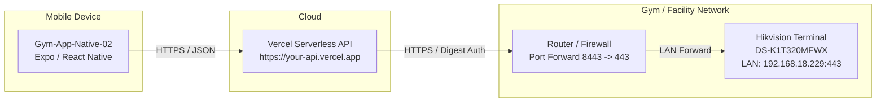

# Hikvision Vercel Serverless Backend API

A lightweight, production-ready serverless backend API built with **Node.js, Express, and TypeScript** designed to deploy directly to **Vercel**. It proxies and manages communication between your **React Native Mobile App** (`Gym-App-Native-02`) and your physical **Hikvision Access Control Terminal** (Model: DS-K1T320MFWX, firmware V3.5.2) over a **Public IP with Router Port Forwarding**.

---

## 🏛️ Architecture Overview



---

## 🚀 Quick Start in 4 Steps

### Step 1: Router Port Forwarding & Terminal Setup

1. **Assign a Static IP or DHCP Reservation to your Hikvision Terminal:**
   - In your router admin dashboard (e.g. `192.168.1.1` or `192.168.18.1`), locate **DHCP Reservation** or **Static Lease**.
   - Bind the MAC address of your Hikvision terminal to its local IP (e.g., `192.168.18.229`).

2. **Configure Port Forwarding on your Router:**
   - Go to **Advanced Settings** > **Port Forwarding** / **Virtual Server**.
   - Add a new rule:
     | Setting | Recommended Value |
     | :--- | :--- |
     | **Rule Name** | `Hikvision_ISAPI` |
     | **External / WAN Port** | `8443` *(Using 8443 avoids ISP blocks on port 443)* |
     | **Internal / LAN IP** | `192.168.18.229` (your terminal IP) |
     | **Internal / LAN Port** | `443` (default terminal HTTPS port) |
     | **Protocol** | `TCP` |

3. **Get your Public IP or Dynamic DNS Domain:**
   - Find your current public WAN IP at [ipify.org](https://api.ipify.org) or [whatismyip.com](https://www.whatismyip.com/).
   - *(Optional but Recommended)* If your ISP assigns a dynamic IP that changes, configure a free DDNS service (such as [DuckDNS](https://www.duckdns.org), [No-IP](https://www.noip.com), or the router's built-in DDNS).
   - Your device public host will be:
     `https://YOUR_PUBLIC_IP:8443` or `https://YOUR_DDNS_DOMAIN:8443`

---

### Step 2: Configure Environment Variables

1. Copy `.env.example` to `.env`:
   ```bash
   cp .env.example .env
   ```

2. Edit `.env` with your public host and credentials:
   ```env
   # Terminal Public Address (Public IP or DDNS)
   HIKVISION_HOST=https://103.45.67.89:8443
   HIKVISION_USERNAME=admin
   HIKVISION_PASSWORD=YourTerminalPassword
   HIKVISION_VERIFY_TLS=false
   HIKVISION_TIMEOUT=12000

   # Server Config
   PORT=4000
   NODE_ENV=production

   # Optional API Security (Protect your Vercel endpoint from unauthorized calls)
   API_SECRET_KEY=
   ```

3. Test locally:
   ```bash
   npm install
   npm run dev
   ```
   Open `http://localhost:4000/api/device/status` in your browser. You should see `online: true` and terminal device details.

---

### Step 3: Deploy to Vercel

You can deploy using either the **Vercel CLI** or the **Vercel Web Dashboard**.

#### Option A: Deploy via Vercel CLI
```bash
# In the hikvision-backend-api folder:
npx vercel
```
- Select your scope and confirm project creation.
- When prompted, deploy to production:
```bash
npx vercel --prod
```

#### Option B: Deploy via GitHub (Vercel Web Dashboard)
1. Push `hikvision-backend-api` to a GitHub repository.
2. In [Vercel Dashboard](https://vercel.com/dashboard), click **Add New...** > **Project** and import the repository.
3. In the project **Settings** > **Environment Variables**, add:
   - `HIKVISION_HOST`: `https://YOUR_PUBLIC_IP:8443`
   - `HIKVISION_USERNAME`: `admin`
   - `HIKVISION_PASSWORD`: `YourTerminalPassword`
   - `HIKVISION_VERIFY_TLS`: `false`
   - `HIKVISION_TIMEOUT`: `12000`
4. Click **Deploy**.

Your live API URL will look like:
`https://hikvision-backend-api.vercel.app`

Test it by visiting:
`https://hikvision-backend-api.vercel.app/api/device/status`

---

### Step 4: Connect to React Native (`Gym-App-Native-02`)

The `Gym-App-Native-02` mobile app is already built to communicate with this backend specification.

1. Open `Gym-App-Native-02/.env`.
2. Add or update the variable:
   ```env
   EXPO_PUBLIC_HIKVISION_API_URL=https://your-project.vercel.app/api
   ```
3. Restart Expo:
   ```bash
   npx expo start -c
   ```
4. In your app:
   - Open the **Attendance** screen to see live attendance logs synced directly from the terminal.
   - Open the **Biometric** screen to view terminal users and fingerprint / face / card counts.

---

## 📡 API Endpoints Reference

All endpoints accept standard JSON requests and return a consistent response envelope:
```json
{
  "success": true,
  "data": { ... },
  "pagination": { "page": 1, "limit": 25, "total": 100, "totalPages": 4 },
  "error": null
}
```

### 1. Device Endpoints
| Method | Endpoint | Description |
| :--- | :--- | :--- |
| `GET` | `/api/device` | Get device summary and connection configuration |
| `GET` | `/api/device/status` | Check terminal online status, latency in ms, and system info |
| `POST` | `/api/device/test` | Test live ISAPI connectivity to the terminal |
| `POST` | `/api/device/sync` | Refresh terminal info cache |
| `POST` | `/api/device/open-door` | Remotely unlock the connected door/turnstile |

#### Example: Remote Door Unlock
```bash
POST /api/device/open-door
Content-Type: application/json

{ "doorNo": 1 }
```

### 2. Users Endpoints
| Method | Endpoint | Description |
| :--- | :--- | :--- |
| `GET` | `/api/users` | List users registered in terminal (supports `?page=1&limit=25&search=john`) |
| `GET` | `/api/users/count` | Total users registered on terminal |
| `GET` | `/api/users/:employeeNo` | Fetch details for a specific user |
| `POST` | `/api/users/sync` | Trigger instant sync from terminal |

### 3. Attendance & Event Endpoints
| Method | Endpoint | Description |
| :--- | :--- | :--- |
| `GET` | `/api/attendance` | Filterable attendance logs (`?page=1&limit=25&employeeNo=101&from=2026-09-01&to=2026-09-23`) |
| `GET` | `/api/attendance/recent` | Recent 10 events |
| `GET` | `/api/attendance/summary` | Today's stats (total check-ins, unique present, failed scans) |
| `GET` | `/api/attendance/user/:id` | Filter attendance for a single employee |
| `POST` | `/api/attendance/sync` | Fetch recent events and sync |

### 4. Dashboard Endpoint
| Method | Endpoint | Description |
| :--- | :--- | :--- |
| `GET` | `/api/dashboard/summary` | All-in-one endpoint: device status, user counts, today's attendance stats, recent 5 events |

---

## 🛡️ Security Best Practices

1. **Use WAN Port Obfuscation:**
   Do not expose port `443` directly to the internet. Map external port `8443` (or a random 5-digit port like `49220`) to internal port `443`.
2. **Terminal Password:**
   Ensure the Hikvision `admin` password is strong (minimum 12 alphanumeric characters with symbols).
3. **Optional API Key Protection:**
   If you want to ensure only your mobile app can call the Vercel API:
   - Set `API_SECRET_KEY=my-super-secret-key` in Vercel and your `.env`.
   - In React Native, pass the header `'x-api-key': 'my-super-secret-key'` in requests (supported automatically in `hikFetch`).
4. **IP Whitelisting (Optional):**
   If you have a static IP or corporate VPN, restrict your router's port forwarding rule to allow connections only from trusted source IPs.

---

## 🛠️ Project Structure

```
hikvision-backend-api/
├── api/
│   └── index.ts               # Vercel Serverless entrypoint
├── src/
│   ├── config/
│   │   └── env.ts             # Type-safe environment variables
│   ├── hikvision/
│   │   ├── HikvisionAuth.ts   # RFC 2617 HTTP Digest Authentication
│   │   ├── HikvisionClient.ts # HTTPS ISAPI client (keepAlive: false, TLS bypass)
│   │   ├── HikvisionDevice.ts # Device Info, Status & Remote Door Control
│   │   ├── HikvisionUsers.ts  # Terminal User Search & Bio Counts
│   │   ├── HikvisionEvents.ts # Access Event Querying & Pagination
│   │   └── eventMappings.ts   # Minor code & Verification mode mappings
│   ├── routes/
│   │   ├── device.routes.ts
│   │   ├── users.routes.ts
│   │   ├── attendance.routes.ts
│   │   └── dashboard.routes.ts
│   ├── app.ts                 # Express configuration, CORS, Error handling
│   └── server.ts              # Local standalone HTTP server
├── .env.example               # Environment variables template
├── package.json
├── tsconfig.json
└── vercel.json                # Vercel deployment configuration
```
